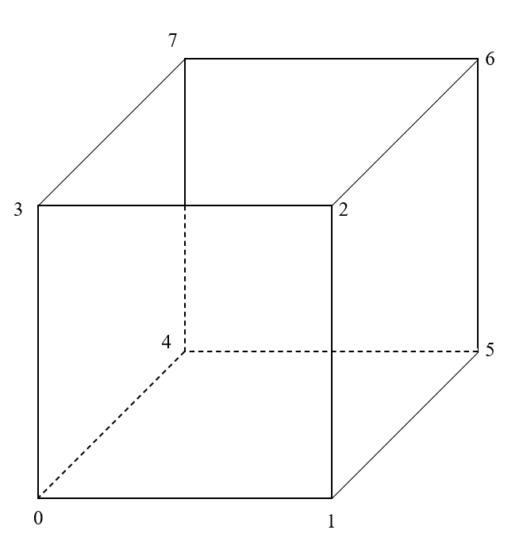

# Modeling a Wireframe Cube

It may be useful to model a wireframe version of the cube before diving into doing the solid version.  This is hopefully simpler as you only need two indices for each edge, and the order of the indices doesn't matter (as it does in determining a faces vertex winding).  It's also a very handy debugging option; more on that later.

Let's say you label the vertices of your code as shown in this diagram.

The edges of such a cube would be as follows:

var edges = [
    0, 1,  // "Front" face edges
    1, 2,
    2, 3,
    3, 0,
    4, 5,  // "Back" face edges
    5, 6,
    6, 7,
    7, 4,
    0, 4,  // "Side" edges
    1, 5,
    2, 6,
    3, 7
];

Of course, the edges' location relies on the position values (i.e., the $(x, y, z)$ values in your `positions` array), so you'll need those first, but this should also help you easily see that you've got the right values for your vertex positions.

Here's an updated version of the `Cube` file shared in yesterday's announcement that contains the code to render these edges.  The added lines are highlighted for easy identification.

function Cube(gl) {

    var program = initShaders(gl, "Cube-vertex-shader", "Cube-fragment-shader");

    var positions = [
        // --> Insert your vertex positions here
    ];
    
    var indices = [
        // --> Insert you index values here
    ];

    var edges = [
        0, 1,  // "Front" face edges
        1, 2,
        2, 3,
        3, 0,
        4, 5,  // "Back" face edges
        5, 6,
        6, 7,
        7, 4,
        0, 4,  // "Side" edges
        1, 5,
        2, 6,
        3, 7
    ];
        
    positions.numComponents = 3;

    positions.buffer = gl.createBuffer();
    gl.bindBuffer( gl.ARRAY_BUFFER, positions.buffer );
    gl.bufferData( gl.ARRAY_BUFFER, new Float32Array(positions), gl.STATIC_DRAW );

    indices.buffer = gl.createBuffer();
    gl.bindBuffer( gl.ELEMENT_ARRAY_BUFFER, indices.buffer );
    gl.bufferData( gl.ELEMENT_ARRAY_BUFFER, new Uint16Array(indices), gl.STATIC_DRAW );

    edges.buffer = gl.createBuffer();
    gl.bindBuffer( gl.ELEMENT_ARRAY_BUFFER, edges.buffer );
    gl.bufferData( gl.ELEMENT_ARRAY_BUFFER, new Uint16Array(edges), gl.STATIC_DRAW );
    
    positions.aPosition = gl.getAttribLocation( program, "aPosition" );
    gl.enableVertexAttribArray( positions.aPosition );

    this.render = function () {
        gl.useProgram( program );

        gl.bindBuffer( gl.ARRAY_BUFFER, positions.buffer );
        gl.vertexAttribPointer( positions.aPosition, positions.numComponents,
            gl.FLOAT, false, 0, 0 );

        gl.bindBuffer( gl.ELEMENT_ARRAY_BUFFER, edges.buffer );
        gl.drawElements( gl.LINES, edges.length, gl.UNSIGNED_SHORT, 0 );

        gl.bindBuffer( gl.ELEMENT_ARRAY_BUFFER, indices.buffer );
        gl.drawElements( gl.TRIANGLES, indices.length, gl.UNSIGNED_SHORT, 0 );
    }
};
